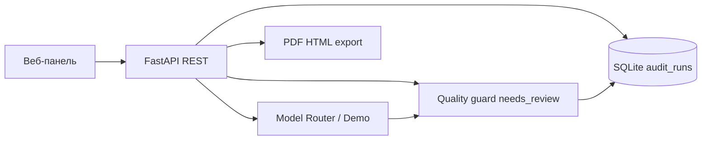

# PPC Audit Workspace

Веб-приложение для **PPC-аудита** рекламных кабинетов Яндекс Директа: загрузка материалов (Excel, заметки, скрины), AI-анализ, ручная проверка выводов маркетологом, клиентский **PDF/HTML-отчёт**.

**Репозиторий:** `https://github.com/Ekaterina-Kotendzhi/PPC-Audit-Workspace-v.0` (после публикации)

**Ценность:** стандартный клиентский PDF **~3,5–5 ч** вручную → **~1,5–2,5 ч** с инструментом (разбор Excel, черновик выводов, контроль качества перед отправкой клиенту).

---

## Содержание

1. [Быстрый старт за 10 минут](#быстрый-старт-за-10-минут)
2. [Требования](#требования)
3. [Переменные окружения](#переменные-окружения)
4. [Архитектура](#архитектура)
5. [Сценарий работы](#сценарий-работы)
6. [API — ключевые точки](#api--ключевые-точки)
7. [Примеры запросов](#примеры-запросов)
8. [Тестовые входы](#тестовые-входы)
9. [Docker](#docker)
10. [Частые проблемы](#частые-проблемы)

---

## Быстрый старт за 10 минут

Запуск **без ключей API** — включится демо-режим (данные наружу не уходят).

### Вариант A — Docker (рекомендуется)

**Нужно:** [Docker Desktop](https://www.docker.com/products/docker-desktop/).

```powershell
cd $env:USERPROFILE\Documents
git clone https://github.com/Ekaterina-Kotendzhi/PPC-1.git PPC-Audit-Clean
cd PPC-Audit-Clean
docker compose up --build
```

> Не запускайте из `C:\WINDOWS\System32` — будет `Permission denied` и `no configuration file provided`.

1. Дождитесь `Application startup complete` (первый build: 5–15 мин).
2. Откройте **http://localhost:8000**
3. **+ Новый аудит** → **Директ** → загрузите Excel Мастер-отчёта.
4. **Запуск AI** → согласие в модалке → дождитесь завершения.
5. **Выводы** → подтвердите 1–2 карточки.
6. **Отчёт** → **Предпросмотр PDF**.

Остановка: `Ctrl+C` или `docker compose down`.

### Вариант B — Python локально (Windows)

```powershell
cd $env:USERPROFILE\Documents
git clone https://github.com/Ekaterina-Kotendzhi/PPC-1.git PPC-Audit-Clean
cd PPC-Audit-Clean
powershell -ExecutionPolicy Bypass -File .\scripts\setup-venv.ps1
copy .env.example .env
cd frontend && npm install && npm run build && cd ..
.\.venv\Scripts\python.exe -m uvicorn app.main:app --host 127.0.0.1 --port 8000
```

Браузер: **http://localhost:8000** — те же шаги 3–6.

### Автотесты (опционально)

```powershell
.\.venv\Scripts\python.exe -m pytest tests/ -q
# или в Docker:
docker compose run --rm app python -m pytest tests/ -q
```

---

## Требования

| Компонент | Версия / примечание |
|-----------|---------------------|
| Python | 3.12+ (локальный запуск) |
| Node.js | 18+ (сборка frontend) |
| Docker Desktop | опционально, воспроизводимый запуск |
| Браузер | Chrome / Edge |
| Tesseract OCR | опционально, текст со скринов (Windows) |

Файлы конфигурации в репозитории:

| Файл | Назначение |
|------|------------|
| `.env.example` | шаблон переменных (ключи пустые) |
| `.env.docker` | демо-режим для Docker (`PPC_FORCE_DEMO_AI=true`) |

**Не коммитить** локальный `.env` с реальными ключами API.

---

## Переменные окружения

Основные переменные (полный список — в `.env.example`):

| Переменная | По умолчанию | Назначение |
|------------|--------------|------------|
| `DATABASE_URL` | `sqlite:///data/app.db` | SQLite (или PostgreSQL) |
| `PPC_FORCE_DEMO_AI` | `false` / `true` в `.env.docker` | Демо без внешнего API |
| `ANTHROPIC_API_KEY` | пусто | Ключ ProxyAPI / Anthropic |
| `OPENAI_API_KEY` | пусто | Ключ OpenAI fallback |
| `AI_TEMPERATURE_ANALYSIS` | `0.3` | Температура основного анализа |
| `AI_TEMPERATURE_CP` | `0.7` | Температура КП |
| `REQUIRE_AI_CONSENT` | `true` | Согласие в модалке перед AI |
| `AI_DEFAULT_EXCLUDE_REVENUE` | `true` | Маскировать выручку в промпте |
| `KNOWLEDGE_BASE_ENABLED` | `true` | Chroma KB подтверждённых выводов |
| `OCR_PROVIDER` | `tesseract_cli` / `disabled` | OCR скринов |

**Демо-режим:** оставьте API-ключи пустыми или задайте `PPC_FORCE_DEMO_AI=true` — анализ идёт локально, без отправки данных наружу.

**Внешний AI:** заполните `ANTHROPIC_API_KEY` и/или `OPENAI_API_KEY`, `PPC_FORCE_DEMO_AI=false`.

---

## Архитектура



| Слой | Технология |
|------|------------|
| Backend | FastAPI, SQLAlchemy, SQLite |
| Frontend | ES-модули → esbuild → `app.js` |
| AI | Claude/OpenAI через ProxyAPI или demo |
| PDF | Playwright Chromium |
| KB | Chroma (подтверждённые выводы) |

**Три роли API:**

1. **Создать** — `POST /api/audits/`, материалы, `POST .../analyze`
2. **Витрина** — `GET /api/audits/`
3. **ИИ + JSON** — analyze → `audit_runs.output_json`

---

## Сценарий работы

| Шаг | Действие |
|-----|----------|
| 1 | Создать аудит, указать нишу и цель |
| 2 | Загрузить Мастер-отчёт Excel на **Директ** |
| 3 | При необходимости — материалы на **Источники**, галочка **«В AI»** |
| 4 | **Запуск AI** (модалка: контекст, согласие) |
| 5 | **Выводы** — confirm / edit / reject каждой карточки |
| 6 | **Отчёт** — enrich summary/КП, preview PDF |
| 7 | Экспорт PDF клиенту |

В PDF попадают только выводы со статусом `human_confirmed` / `human_edited`.

---

## API — ключевые точки

| Метод | Путь | Роль |
|-------|------|------|
| POST | `/api/audits/` | Создать аудит |
| GET | `/api/audits/` | Список (витрина) |
| GET | `/api/audits/{id}` | Карточка аудита |
| POST | `/api/audits/{id}/analyze` | AI-анализ → JSON |
| GET | `/api/audit-runs/{audit_id}` | Журнал input/output |
| POST | `/api/audits/{id}/findings/{fid}/confirm` | Подтвердить вывод |
| GET | `/api/audits/{id}/export/pdf` | PDF для клиента |
| GET | `/api/privacy/settings` | Настройки маскирования PII |

Интерактивная документация после запуска: **http://localhost:8000/docs**

---

## Примеры запросов

Базовый URL: `http://localhost:8000`

### 1) Создать аудит

```powershell
$body = @{
  client_name = "Demo Client"
  niche = "Клининг"
  goal = "Снизить CPL"
} | ConvertTo-Json

Invoke-RestMethod -Method Post `
  -Uri "http://localhost:8000/api/audits/" `
  -ContentType "application/json; charset=utf-8" `
  -Body $body
```

```bash
curl -X POST "http://localhost:8000/api/audits/" \
  -H "Content-Type: application/json" \
  -d '{"client_name":"Demo Client","niche":"Клининг","goal":"Снизить CPL"}'
```

### 2) Список аудитов

```powershell
Invoke-RestMethod -Method Get -Uri "http://localhost:8000/api/audits/"
```

```bash
curl "http://localhost:8000/api/audits/"
```

### 3) Запуск AI-анализа

```powershell
$auditId = 1
Invoke-RestMethod -Method Post -Uri "http://localhost:8000/api/audits/$auditId/analyze"
```

```bash
curl -X POST "http://localhost:8000/api/audits/1/analyze"
```

### 4) Журнал запусков

```powershell
Invoke-RestMethod -Method Get -Uri "http://localhost:8000/api/audit-runs/1"
```

```bash
curl "http://localhost:8000/api/audit-runs/1"
```

### 5) Экспорт PDF

```powershell
Invoke-WebRequest -Uri "http://localhost:8000/api/audits/1/export/pdf" -OutFile ".\report.pdf"
```

```bash
curl -L "http://localhost:8000/api/audits/1/export/pdf" -o report.pdf
```

> `needs_review` в ответе AI — ожидаемое поведение quality guard. Подтверждение — на вкладке **«Выводы»**.

---

## Тестовые входы

Файл [`tests_data/inputs.jsonl`](tests_data/inputs.jsonl) — **10 сценариев** для проверки (ниша, цель, ожидаемый фокус аудита).

Формат — JSON Lines, одна строка = один кейс:

```json
{"id":"case-01","title":"Клининг в Москве","input":{"client_name":"CleanHouse","niche":"Клининг","region":"Москва","goal":"Снизить CPL"},"expected_focus":"Проверка семантики..."}
```

Использование: подставьте `client_name`, `niche`, `goal` в `POST /api/audits/` при ручной или автоматической проверке.

---

## Docker

В репозитории:

| Файл | Назначение |
|------|------------|
| `Dockerfile` | multi-stage: Node (frontend) + Python 3.12 + Playwright |
| `docker-compose.yml` | сервис `app`, порт 8000, volumes `data/`, `uploads/`, `exports/` |
| `.env.docker` | демо без ключей, OCR отключён в контейнере |

```powershell
docker compose up --build
docker compose down
```

Первый build скачивает Chromium (~160 MB) — нужен интернет. При timeout повторите `docker compose build`.

---

## Частые проблемы

| Симптом | Решение |
|---------|---------|
| `Permission denied` при `git clone` | Не в `System32`. `cd $env:USERPROFILE\Documents` |
| `no configuration file provided` | `cd` в папку с `docker-compose.yml` |
| Порт 8000 занят | `docker compose down` или другой порт |
| Build падает на Playwright | Стабильный интернет, повторить build |
| PDF пустой | Подтвердить выводы на «Выводы», refresh summary на «Отчёт» |
| `database is locked` | Один процесс сервера, перезапуск |

---

## Стек и лицензия

- **FastAPI**, **SQLAlchemy**, **SQLite**, **Playwright**, **Chroma**
- Разработка: [github.com/Ekaterina-Kotendzhi/PPC-1](https://github.com/Ekaterina-Kotendzhi/PPC-1)

*PPC Audit Workspace — июнь 2026.*
