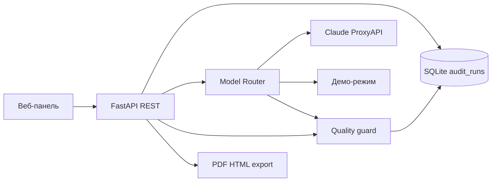

# PPC Audit Workspace

Веб-приложение для **PPC-аудита** рекламных кабинетов Яндекс Директа: загрузка материалов (Excel, заметки, скрины), AI-анализ, ручная проверка выводов маркетологом, клиентский **PDF/HTML-отчёт**.

**Репозиторий:** https://github.com/Ekaterina-Kotendzhi/PPC-Audit-Workspace-v.0

**Ценность:** стандартный клиентский PDF **~3,5–5 ч** вручную → **~1,5–2,5 ч** с инструментом (разбор Excel, черновик выводов, контроль качества перед отправкой клиенту).

### Пакет к сдаче

| | Файл |
|---|------|
| **Отчёт** | [ОТЧЕТ.md](ОТЧЕТ.md) |
| **Защита** | [ЗАЩИТА.md](ЗАЩИТА.md) |
| **Видео** | [Loom](https://www.loom.com/share/dfe9adcb5a684d21b0d69026876f5069) · [ССЫЛКИ-ВИДЕО.md](ССЫЛКИ-ВИДЕО.md) |
| **Скриншоты UI / PDF** | [docs/screenshots/](docs/screenshots/) |
| **Чеклист** | [ЧЕКЛИСТ-СДАЧИ.md](ЧЕКЛИСТ-СДАЧИ.md) |
| **Воспроизводимость** | [ПРОВЕРКА-ЧИСТАЯ-МАШИНА.md](ПРОВЕРКА-ЧИСТАЯ-МАШИНА.md) |

---

## Содержание

1. [Быстрый старт за 10 минут](#быстрый-старт-за-10-минут)
2. [Требования](#требования)
3. [Переменные окружения](#переменные-окружения)
4. [AI и модели](#ai-и-модели)
5. [Архитектура](#архитектура)
6. [Сценарий работы](#сценарий-работы)
7. [API — ключевые точки](#api--ключевые-точки)
8. [Примеры запросов](#примеры-запросов)
9. [Тестовые входы](#тестовые-входы)
10. [Docker](#docker)
11. [Частые проблемы](#частые-проблемы)

---

## Быстрый старт за 10 минут

Запуск **без ключей API** — включится демо-режим (данные наружу не уходят).

### Вариант A — Docker (рекомендуется)

**Нужно:** [Docker Desktop](https://www.docker.com/products/docker-desktop/).

```powershell
cd $env:USERPROFILE\Documents
git clone https://github.com/Ekaterina-Kotendzhi/PPC-Audit-Workspace-v.0.git
cd PPC-Audit-Workspace-v.0
docker compose up --build
```

> Не запускайте из `C:\WINDOWS\System32` — будет `Permission denied` и `no configuration file provided`.

1. Дождитесь `Application startup complete` (первый build: 5–15 мин).
2. Откройте **http://localhost:8000**
3. **+ Новый аудит** → **Данные → Директ** → загрузите Excel Мастер-отчёта.
4. (Опционально) **Источники** → галочка **«Будет в AI»** на скринах/заметках.
5. **Запуск AI** → модалка: согласие → дождитесь 100%.
6. **Выводы** → подтвердите 1–2 карточки.
7. **Отчёт** → **Предпросмотр PDF**.

Остановка: `Ctrl+C` или `docker compose down`.  
Логи: `docker logs -f ppc_audit_workspace`

### Вариант B — Python локально (Windows)

```powershell
cd $env:USERPROFILE\Documents
git clone https://github.com/Ekaterina-Kotendzhi/PPC-Audit-Workspace-v.0.git
cd PPC-Audit-Workspace-v.0
powershell -ExecutionPolicy Bypass -File .\scripts\setup-venv.ps1
copy .env.example .env
cd frontend && npm install && npm run build && cd ..
.\.venv\Scripts\python.exe -m uvicorn app.main:app --host 127.0.0.1 --port 8000 --log-level debug --access-log
```

Браузер: **http://localhost:8000** — те же шаги 3–7.

### Автотесты (опционально)

```powershell
.\.venv\Scripts\python.exe -m pytest tests/ -q
# или в Docker:
docker compose run --rm app python -m pytest tests/ -q
```

---

## Требования

| Компонент | Версия / примечание |
|-----------|---------------------|
| Python | 3.12+ (локальный запуск) |
| Node.js | 18+ (сборка frontend) |
| Docker Desktop | опционально, воспроизводимый запуск |
| Браузер | Chrome / Edge |
| Tesseract OCR | опционально локально; **в Docker-образе уже установлен** |

Файлы конфигурации:

| Файл | Назначение |
|------|------------|
| `.env.example` | шаблон переменных (ключи пустые) |
| `.env.docker.example` | **демо для Docker** (`PPC_FORCE_DEMO_AI=true`, без ключей) |

**Не коммитить** `.env` и `.env.docker` с реальными ключами API (оба в `.gitignore`). Для ключей локально: `copy .env.docker.example .env.docker`.

---

## Переменные окружения

Основные переменные (полный список — в `.env.example`):

| Переменная | По умолчанию | Назначение |
|------------|--------------|------------|
| `DATABASE_URL` | `sqlite:///data/app.db` | SQLite |
| `LOG_LEVEL` | `INFO` | Логи приложения и uvicorn (`DEBUG` для отладки) |
| `PPC_FORCE_DEMO_AI` | `false` / `true` в `.env.docker.example` | Демо без внешнего API |
| `ANTHROPIC_API_KEY` | пусто | Ключ ProxyAPI / Anthropic |
| `OPENAI_API_KEY` | пусто | Ключ OpenAI fallback / embeddings |
| `AI_ANALYSIS_MAX_TOKENS` | `8192` | Лимит токенов ответа анализа |
| `AI_TRANSPORT` | `native` | `native` или `proxyapi_unified` |
| `AI_TEMPERATURE_ANALYSIS` | `0.3` | Температура основного анализа |
| `REQUIRE_AI_CONSENT` | `true` | Согласие в модалке перед AI |
| `KNOWLEDGE_BASE_ENABLED` | `true` | Chroma KB подтверждённых выводов |
| `OCR_PROVIDER` | `tesseract_cli` / `disabled` | OCR скринов |

**Демо-режим:** пустые ключи или `PPC_FORCE_DEMO_AI=true` — анализ локально, без отправки данных наружу.

**Внешний AI (Claude):** ключ ProxyAPI в `ANTHROPIC_API_KEY`, `PPC_FORCE_DEMO_AI=false`, выбор модели в UI.

---

## AI и модели

Селектор в модалке «Запустить AI-анализ» (`GET /api/ai/models`):

| ID | Название | Провайдер |
|----|----------|-----------|
| `gpt-4o` | GPT-4o | OpenAI |
| `gpt-4o-mini` | GPT-4o mini | OpenAI |
| `claude-opus-4-5` | Claude Opus 4.5 | Anthropic |
| `claude-sonnet-4-5` | Claude Sonnet 4.5 | Anthropic |
| `claude-haiku-4-5` | Claude Haiku 4.5 | Anthropic |

Перед запуском показывается **оценка стоимости** в ₽ и USD.

**Надёжность ответа:** парсинг JSON, повтор при синтаксической ошибке, автодополнение неполных блоков (графики, схемы, КП), quality guard для выводов без доказательств.

---

## Архитектура



| Слой | Технология |
|------|------------|
| Backend | FastAPI, SQLAlchemy, SQLite |
| Frontend | ES-модули → esbuild → `app.js` |
| AI | Model Router: Claude / GPT через ProxyAPI или demo |
| OCR | Tesseract rus+eng (в Docker-образе) |
| PDF | Playwright Chromium |
| KB | Chroma (подтверждённые выводы) |

**Три роли API:**

1. **Создать** — `POST /api/audits/`, материалы, `POST .../analyze/start`
2. **Витрина** — `GET /api/audits/`
3. **ИИ + JSON** — analyze → `audit_runs.output_json`

---

## Сценарий работы

| Шаг | Действие |
|-----|----------|
| 1 | Создать аудит, указать нишу и цель |
| 2 | Загрузить Мастер-отчёт Excel на **Директ** |
| 3 | На **Источники** — отметить материалы **«В AI»** |
| 4 | **Запуск AI** (модалка: модель, контекст, согласие) |
| 5 | **Выводы** — confirm / edit / reject |
| 6 | **Отчёт** — enrich summary/КП, preview PDF |
| 7 | Экспорт PDF клиенту |

В PDF попадают только выводы со статусом `human_confirmed` / `human_edited`.

---

## API — ключевые точки

| Метод | Путь | Роль |
|-------|------|------|
| POST | `/api/audits/` | Создать аудит |
| GET | `/api/audits/` | Список |
| GET | `/api/audits/{id}` | Карточка аудита |
| POST | `/api/audits/{id}/analyze/start` | AI-анализ (WebSocket прогресс) |
| POST | `/api/audits/{id}/analyze/estimate` | Оценка стоимости |
| GET | `/api/ai/models` | Каталог моделей |
| GET | `/api/audit-runs/{audit_id}` | Журнал input/output |
| POST | `/api/audits/{id}/findings/{fid}/confirm` | Подтвердить вывод |
| GET | `/api/audits/{id}/export/pdf` | PDF для клиента |
| GET | `/api/privacy/settings` | Настройки маскирования PII |

Интерактивная документация: **http://localhost:8000/docs**

---

## Примеры запросов

Базовый URL: `http://localhost:8000`

### 1) Создать аудит

```powershell
$body = @{
  client_name = "Demo Client"
  niche = "Клининг"
  goal = "Снизить CPL"
} | ConvertTo-Json

Invoke-RestMethod -Method Post `
  -Uri "http://localhost:8000/api/audits/" `
  -ContentType "application/json; charset=utf-8" `
  -Body $body
```

### 2) Список аудитов

```powershell
Invoke-RestMethod -Method Get -Uri "http://localhost:8000/api/audits/"
```

### 3) Каталог моделей AI

```powershell
Invoke-RestMethod -Method Get -Uri "http://localhost:8000/api/ai/models"
```

### 4) Журнал запусков

```powershell
Invoke-RestMethod -Method Get -Uri "http://localhost:8000/api/audit-runs/1"
```

### 5) Экспорт PDF

```powershell
Invoke-WebRequest -Uri "http://localhost:8000/api/audits/1/export/pdf" -OutFile ".\report.pdf"
```

> `needs_review` в ответе AI — ожидаемое поведение quality guard. Подтверждение — на вкладке **«Выводы»**.

---

## Тестовые входы

Файл [`tests_data/inputs.jsonl`](tests_data/inputs.jsonl) — **10 сценариев** (ниша, цель, ожидаемый фокус).

```json
{"id":"case-01","title":"Клининг в Москве","input":{"client_name":"CleanHouse","niche":"Клининг","region":"Москва","goal":"Снизить CPL"},"expected_focus":"Проверка семантики..."}
```

---

## Docker

| Файл | Назначение |
|------|------------|
| `Dockerfile` | multi-stage: Node + Python 3.12 + Playwright + Tesseract |
| `docker-compose.yml` | сервис `app`, порт 8000, volumes `data/`, `uploads/`, `exports/` |
| `.env.docker.example` | демо без ключей (опционально `.env.docker` локально) |
| `scripts/docker-entrypoint.sh` | uvicorn с `LOG_LEVEL` |

```powershell
docker compose up --build
docker compose down
docker logs -f ppc_audit_workspace
```

Первый build скачивает Chromium (~160 MB) — нужен интернет.

---

## Частые проблемы

| Симптом | Решение |
|---------|---------|
| `Permission denied` при `git clone` | `cd $env:USERPROFILE\Documents` |
| `no configuration file provided` | `cd` в папку с `docker-compose.yml` |
| Порт 8000 занят | `docker compose down` |
| Build падает на Playwright | Повторить `docker compose build` |
| AI failed (демо) | `PPC_FORCE_DEMO_AI=true`, ключи пустые |
| AI failed (Claude) | Ключ ProxyAPI; обновить репозиторий; см. логи |
| `Validation error` charts/schemes | Обновить репозиторий (автодополнение схемы) |
| PDF export 500 | `docker compose up --build` после обновления репозитория |
| PDF пустой | Подтвердить выводы на «Выводы» |
| Tesseract не найден (Docker) | Образ уже содержит Tesseract; `OCR_PROVIDER=tesseract_cli` |
| `database is locked` | Один процесс сервера |

---

## Стек

**FastAPI**, **SQLAlchemy**, **SQLite**, **Playwright**, **Chroma**, **Tesseract**, **ProxyAPI** (Claude/GPT)

*PPC Audit Workspace v.0 — июнь 2026.*
