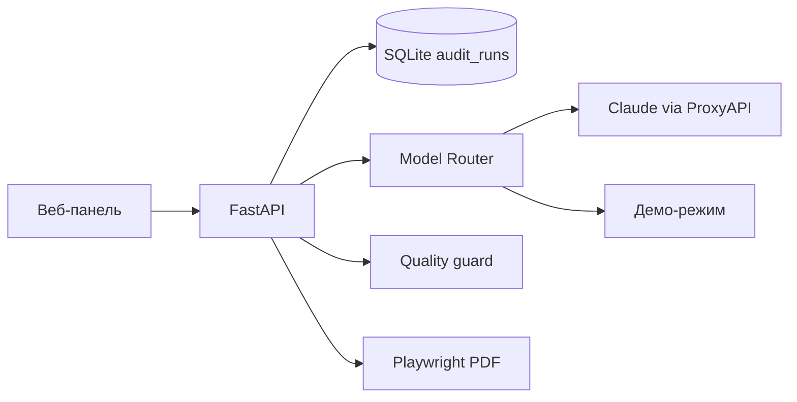

# ЗАЩИТА (5–7 МИН)

**Проект:** PPC Audit Workspace v.0  
**Репозиторий:** https://github.com/Ekaterina-Kotendzhi/PPC-Audit-Workspace-v.0  
**Версия:** последний `master` на GitHub (июнь 2026)

---

## 0:00–0:40 — Проблема

PPC-аудит вручную занимает **3,5–5 часов** на один клиентский отчёт: сбор Excel и скринов, разбор метрик, формулировка выводов, оформление PDF. При этом качество зависит от опыта маркетолога, а типовые ошибки (семантика, CRM, посадочные) повторяются из проекта в проект.

---

## 0:40–1:40 — Решение

Я разработала веб-приложение **PPC Audit Workspace v.0**, которое стандартизирует и ускоряет подготовку аудита:

| Этап | Что делает система |
|------|-------------------|
| Данные | Загрузка Excel Директа, скринов, заметок; OCR текста со скринов |
| AI-анализ | Claude / GPT через ProxyAPI или локальный демо-режим |
| Контроль | Маркетолог подтверждает / правит / отклоняет каждый вывод |
| Отчёт | PDF/HTML только с подтверждёнными выводами |

**Ключевая идея:** AI даёт черновик, человек несёт ответственность за финальный текст клиенту.

---

## 1:40–3:30 — Демонстрация (показать на экране)

1. **Запуск:** `docker compose up --build` → http://localhost:8000
2. **Новый аудит** — клиент, ниша (например, турагентство), цель.
3. **Данные → Директ** — загрузить Мастер-отчёт `.xlsx`.
4. **Источники** — отметить скрины галочкой **«Будет в AI»** (при необходимости).
5. **Запуск AI** — в модалке: выбрать модель (демо или Claude), принять согласие, дождаться 100%.
6. **Выводы** — подтвердить 1–2 карточки (`human_confirmed`).
7. **Отчёт** — предпросмотр PDF в новой вкладке.

> Для защиты без интернета и ключей: `.env.docker.example` с `PPC_FORCE_DEMO_AI=true` — анализ идёт локально.

---

## 3:30–4:40 — Архитектура

| Слой | Технология |
|------|------------|
| Backend | FastAPI, SQLAlchemy, SQLite |
| Frontend | ES modules → esbuild → `app.js` |
| AI | Model Router: Claude Opus/Sonnet/Haiku, GPT-4o; ProxyAPI или demo |
| OCR | Tesseract (в Docker-образе; опционально на Windows) |
| PDF | Playwright Chromium |
| KB | Chroma — подтверждённые выводы в повторных анализах |

**Надёжность AI (commit `3551632`):** JSON через unified ProxyAPI, парсинг и починка битого JSON, автодополнение неполных ответов (графики, схемы, КП).

---

## 4:40–5:40 — Результат

| Показатель | Было | Стало |
|------------|------|-------|
| Время на отчёт | 3,5–5 ч | 1,5–2,5 ч |
| Экономия | — | **35–45%** |
| Воспроизводимость | — | `git clone` → Docker → PDF за ~15–25 мин |

**Экономический эффект** (оценка): при 100 отчётах в год экономия **~350–500 тыс. руб.** времени специалиста.

---

## 5:40–7:00 — Итог и вопросы

- Проект **воспроизводим** на чистой машине — см. `ПРОВЕРКА-ЧИСТАЯ-МАШИНА.md`.
- Пакет сдачи: `ЧЕКЛИСТ-СДАЧИ.md`, `ОТЧЕТ-ПО-ШАБЛОНУ.md`, видео — `ССЫЛКИ-ВИДЕО.md`.
- Готов к практическому использованию в процессе PPC-аудита с контролем качества со стороны маркетолога.

**Возможные вопросы комиссии:**

| Вопрос | Короткий ответ |
|--------|----------------|
| Куда уходят данные клиента? | В демо — никуда. С ключами — в ProxyAPI (обезличенный контекст + согласие в модалке). |
| Можно ли без AI? | Да, демо-режим работает без ключей. |
| Как проверить выводы? | Вкладка «Выводы»: confirm / edit / reject; в PDF только подтверждённые. |
