# ОТЧЁТ ПО ШАБЛОНУ

## Тема

**PPC Audit Workspace v.0** — веб-приложение для ускорения и стандартизации PPC-аудита рекламных кампаний Яндекс Директа.

## Ссылка на репозиторий

https://github.com/Ekaterina-Kotendzhi/PPC-Audit-Workspace-v.0

**Версия:** последний commit в ветке `master` на GitHub (июнь 2026).

---

## 1. Постановка задачи

### Проблема «до»

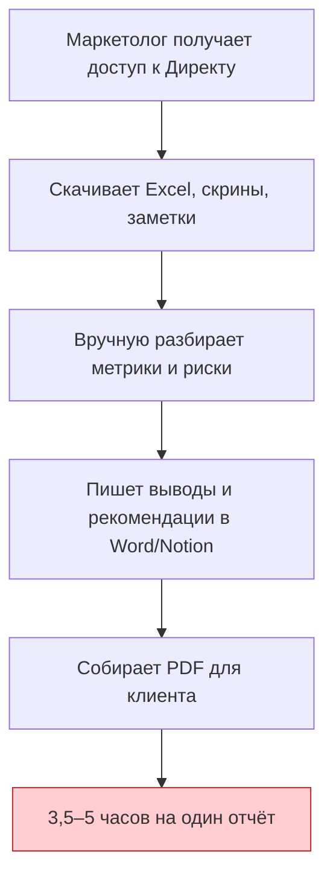

| Боль | Последствие |
|------|-------------|
| Разрозненные материалы | Потеря времени на сбор контекста |
| Нет единого шаблона выводов | Разное качество отчётов |
| AI «в чате» без контроля | Риск галлюцинаций в клиентском PDF |
| Нет журнала анализа | Сложно воспроизвести, что было отправлено в AI |

### Цель проекта

Сократить время подготовки PPC-аудита **на 35–45%**, сохранив **контроль маркетолога** над каждым выводом перед отправкой клиенту.

---

## 2. Решение — обзор

### Бизнес-процесс «после»

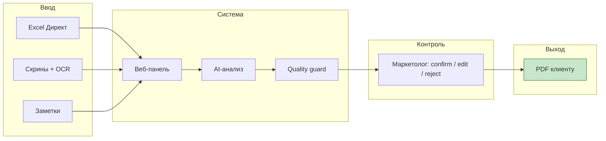

### Роли: человек и AI

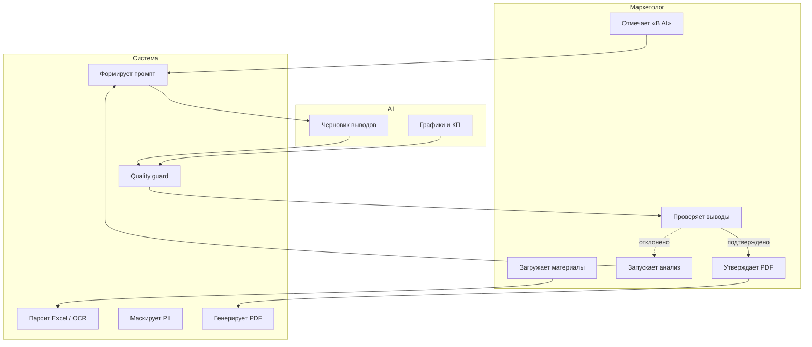

**Принцип:** AI — черновик; в PDF попадают только `human_confirmed` / `human_edited`.

---

## 3. Архитектура системы

### Компоненты

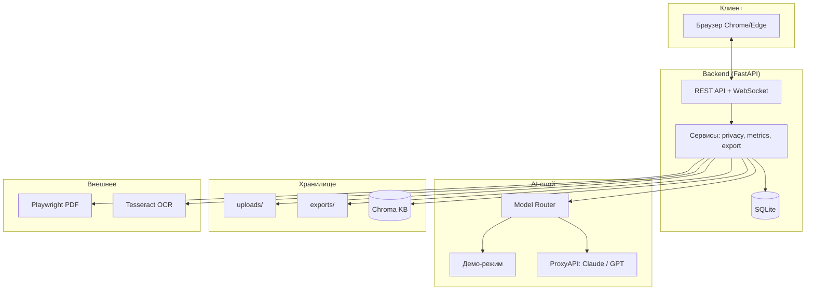

### Стек технологий

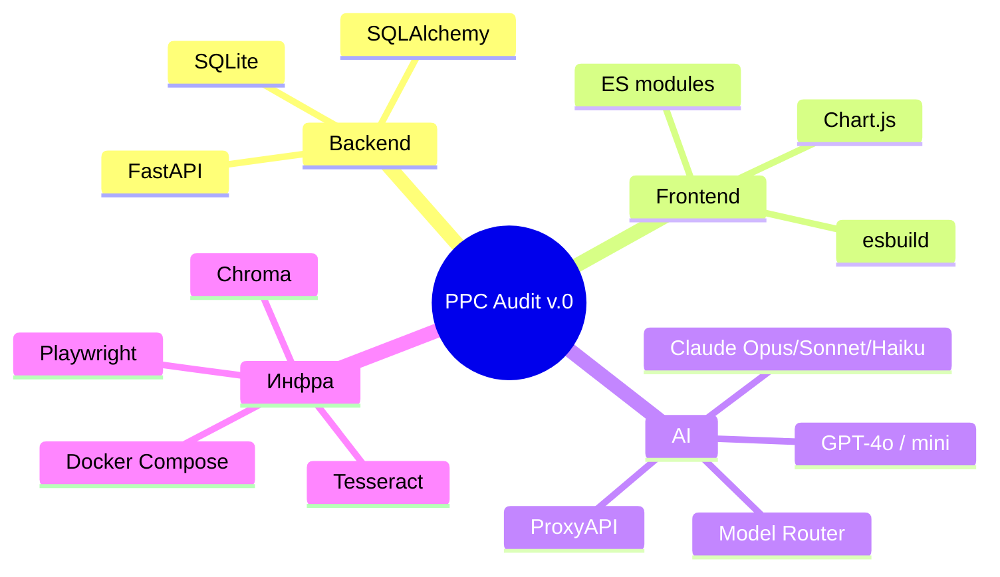

| Слой | Технология | Назначение |
|------|------------|------------|
| API | FastAPI | REST, WebSocket прогресса анализа |
| БД | SQLite | Аудиты, материалы, `audit_runs`, выводы |
| UI | `app.js` (esbuild) | Карточка аудита, модалки, вкладки |
| AI | Model Router | Claude primary, OpenAI fallback, demo |
| PDF | Playwright | HTML → PDF для клиента |
| KB | Chroma | Подтверждённые выводы в повторных анализах |
| OCR | Tesseract | Текст со скринов (rus+eng) |

---

## 4. Поток данных и AI-пайплайн

### От материалов до PDF

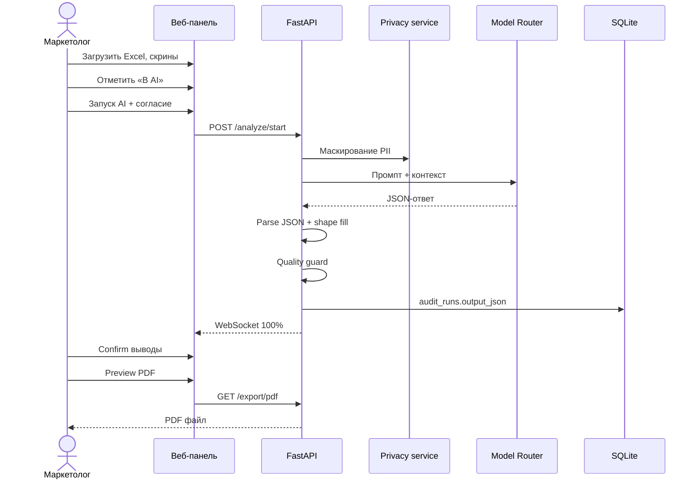

### Цепочка надёжности AI

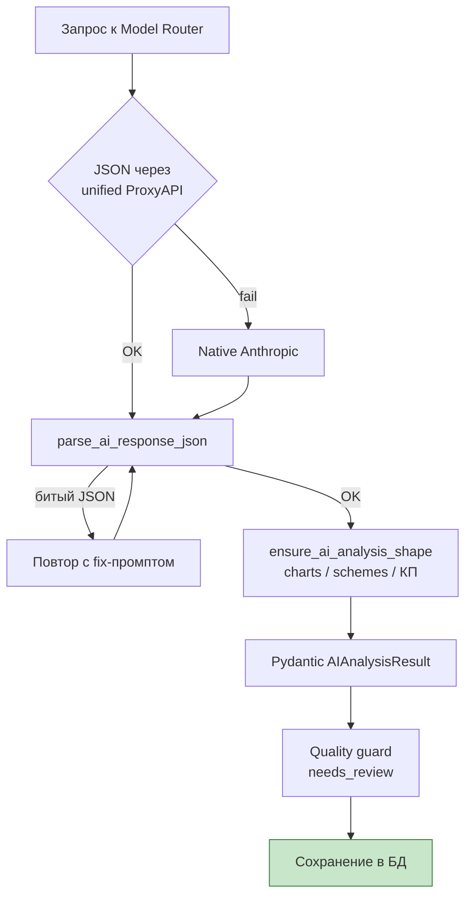

### Модели в селекторе

| Модель | Назначение | Ориентир по стоимости |
|--------|------------|----------------------|
| Claude Opus 4.5 | Максимальное качество анализа | выше |
| Claude Sonnet 4.5 | Баланс цена/качество | средняя |
| Claude Haiku 4.5 | Быстрые черновики | ниже |
| GPT-4o | Fallback / альтернатива | средняя |
| GPT-4o mini | Оценка / экономичный прогон | низкая |
| Демо-режим | Сдача без ключей API | бесплатно |

---

## 5. Что сделано

### Функциональность

| № | Возможность | Статус |
|---|-------------|--------|
| 1 | Полный цикл: данные → AI → выводы → PDF | ✅ |
| 2 | Excel Директа: KPI, риски, health score | ✅ |
| 3 | Ручной выбор материалов «В AI» | ✅ |
| 4 | Селектор модели + оценка стоимости в ₽/USD | ✅ |
| 5 | Quality guard (`needs_review`) | ✅ |
| 6 | База знаний Chroma (подтверждённые выводы) | ✅ |
| 7 | Журнал `audit_runs` (input/output JSON) | ✅ |
| 8 | Маскирование PII, согласие перед AI | ✅ |

### Вкладки интерфейса

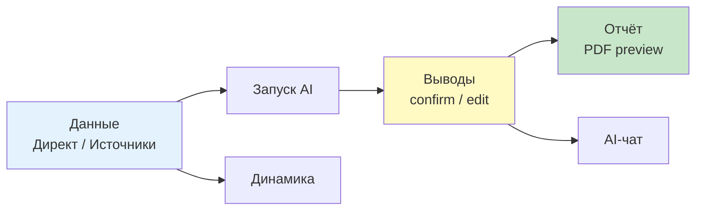

### Документация

| Файл | Назначение |
|------|------------|
| `README.md` | Быстрый старт, API |
| `ПРОВЕРКА-ЧИСТАЯ-МАШИНА.md` | Воспроизводимость |
| `ЗАЩИТА-5-7-МИН.md` | Текст выступления |
| `ЧЕКЛИСТ-СДАЧИ.md` | Пакет сдачи |
| `ССЫЛКИ-ВИДЕО.md` | Видео-демо |

---

## 6. Экономический эффект

### Сравнение времени

```mermaid
gantt
    title Время на один клиентский отчёт (часы)
    dateFormat X
    axisFormat %s ч

    section Без системы
    Сбор данных           :0, 1
    Разбор метрик         :1, 2
    Формулировка выводов  :2, 2
    Оформление PDF        :4, 1

    section С системой
    Загрузка в систему    :0, 0.5
    AI + проверка выводов :0.5, 1
    PDF из подтверждённых :1.5, 0.5
```

| Показатель | Без системы | С системой | Δ |
|------------|-------------|------------|---|
| Время на отчёт | 3,5–5 ч | 1,5–2,5 ч | **−35–45%** |
| Экономия на 1 проект | — | 1,5–2,5 ч | — |
| За 100 отчётов/год | 350–500 ч | 150–250 ч | **~200–250 ч** |
| В деньгах (оценка)* | — | — | **~350–500 тыс. ₽/год** |

\* При условной ставке специалиста ~1 500–2 000 ₽/ч.

### Где экономится время

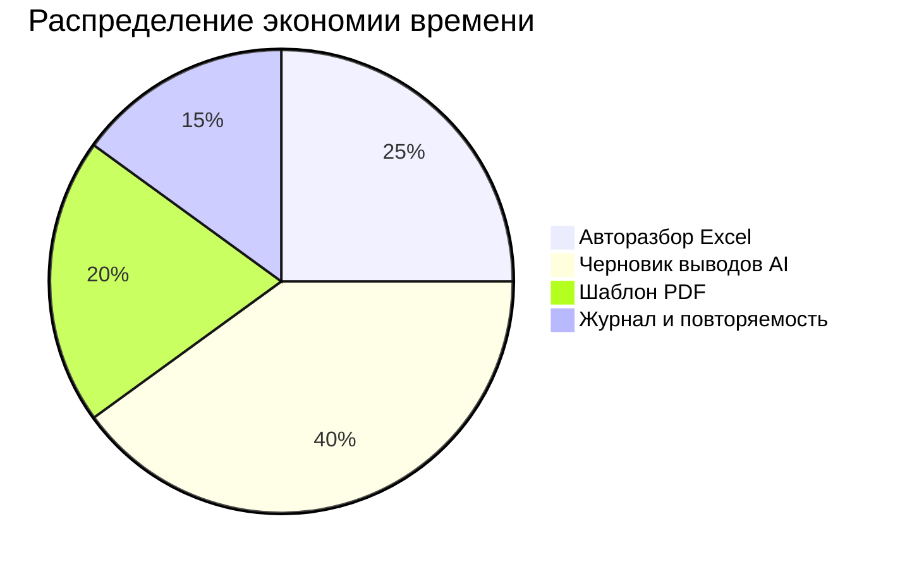

---

## 7. Воспроизводимость

### Сценарий проверки на чистой машине

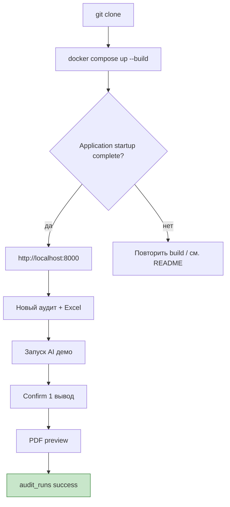

**Критерий успеха:** clone → Docker → UI → AI (демо) → PDF **без ручной донастройки** и **без API-ключей**.

Подробно: [`ПРОВЕРКА-ЧИСТАЯ-МАШИНА.md`](ПРОВЕРКА-ЧИСТАЯ-МАШИНА.md)

### Протокол разработчика

| Поле | Значение |
|------|----------|
| Дата | 2026-06-05 |
| ОС | Windows 11 |
| Способ | Docker (`ppc_audit_workspace`) |
| UI после старта | ~10 сек, HTTP 200 |
| AI (демо) | `audit_runs` → success |
| AI (Claude + ProxyAPI) | success после доработки JSON/shape |
| pytest | `test_ai_json_parse`, `test_ai_analysis_shape` — passed |
| Первый build | 5–15 мин (Playwright Chromium) |

---

## 8. Вывод

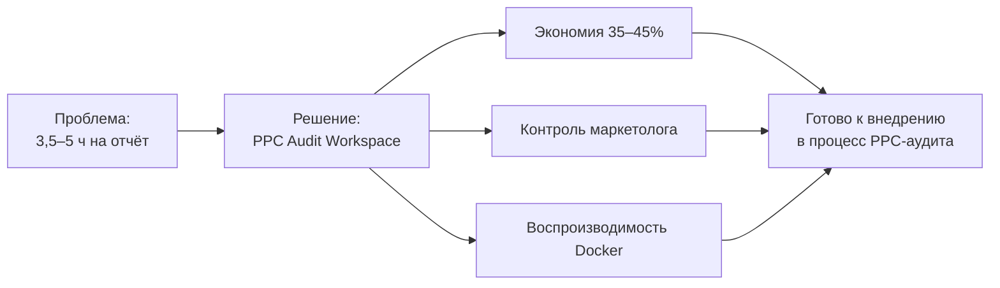

Разработанное веб-приложение **PPC Audit Workspace v.0**:

- **ускоряет** подготовку клиентского PPC-отчёта;
- **стандартизирует** структуру выводов и PDF;
- **сохраняет ответственность** маркетолога через подтверждение каждого вывода;
- **воспроизводимо** запускается на чистой машине по инструкции из репозитория.

Проект готов к **демонстрации**, **защите** и **практическому использованию** в работе PPC-специалиста.
