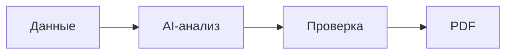
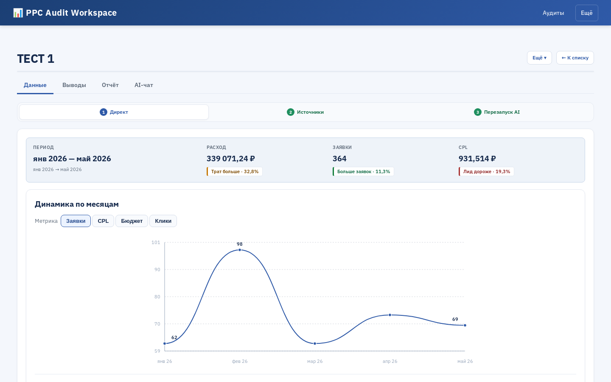
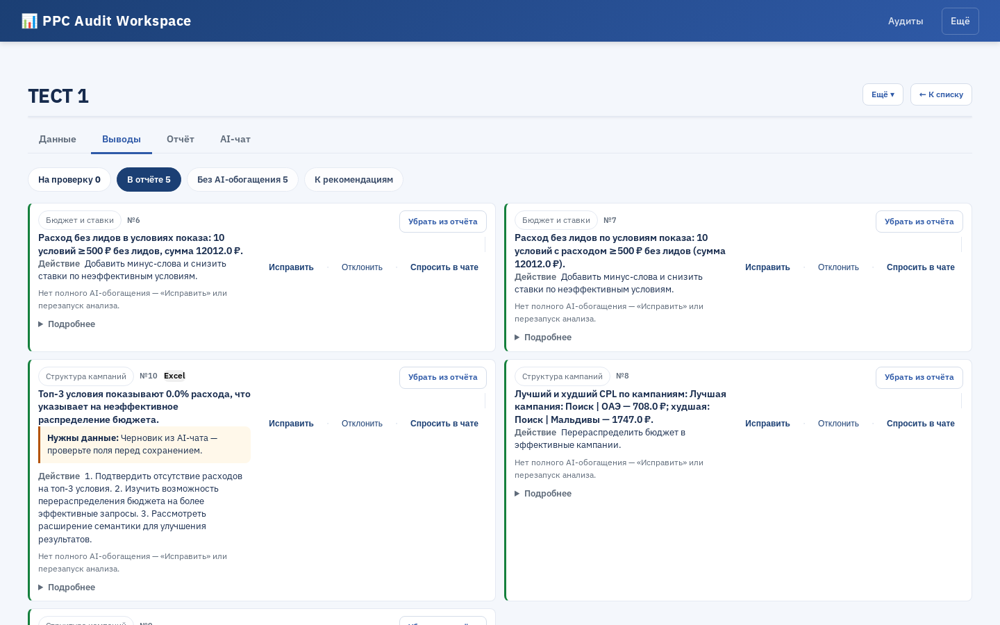
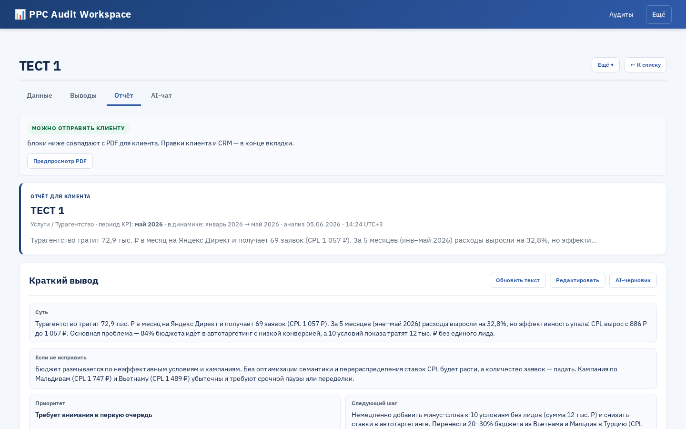
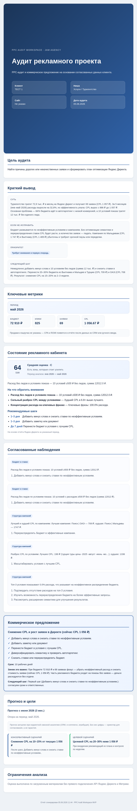

# ОТЧЁТ

## Тема

**PPC Audit Workspace v.0** — веб-приложение для ускорения и стандартизации PPC-аудита Яндекс Директа.

## Ссылки

| | Ссылка |
|---|--------|
| Репозиторий | https://github.com/Ekaterina-Kotendzhi/PPC-Audit-Workspace-v.0 |
| Видео (отчёт и защита) | https://www.loom.com/share/dfe9adcb5a684d21b0d69026876f5069 |
| Текст защиты | [ЗАЩИТА.md](ЗАЩИТА.md) |
| Чеклист сдачи | [ЧЕКЛИСТ-СДАЧИ.md](ЧЕКЛИСТ-СДАЧИ.md) |

---

## Проблема

Подготовка PPC-аудита вручную занимает **3,5–5 часов** на один клиентский отчёт: сбор Excel и скринов, разбор метрик, формулировка выводов, оформление PDF. Качество зависит от опыта маркетолога; при использовании AI «в чате» нет контроля над тем, что попадёт клиенту.

## Решение

Веб-приложение автоматизирует подготовку аудита:

1. Загрузка материалов (Excel Директа, скрины, заметки)
2. AI-анализ (Claude/GPT или демо-режим без ключей)
3. Ручная проверка выводов маркетологом (confirm / edit / reject)
4. Генерация PDF только с подтверждёнными выводами

**Принцип:** AI даёт черновик, маркетолог отвечает за финальный текст клиенту.



---

## Что сделано

- Полный цикл: данные → AI → выводы → PDF
- Загрузка Мастер-отчёта Excel, скринов; выбор материалов **«В AI»**
- Селектор модели AI и оценка стоимости в ₽/USD
- Quality guard: выводы без доказательств → `needs_review`
- Журнал запусков `audit_runs` (input/output JSON)
- Запуск через Docker и Python venv
- Маскирование персональных данных, согласие перед AI

**Стек:** FastAPI, SQLite, Playwright (PDF), Model Router (Claude/GPT), Tesseract OCR, Chroma KB.

---

## Экономический эффект

| Показатель | Было | Стало |
|------------|------|-------|
| Время на отчёт | 3,5–5 ч | 1,5–2,5 ч |
| Экономия | — | **35–45%** |
| За 100 отчётов/год | — | **~350–500 тыс. ₽*** |

\* Оценка времени специалиста при ставке ~1 500–2 000 ₽/ч.

---

## Воспроизводимость

Проверка на чистой машине:

```powershell
git clone https://github.com/Ekaterina-Kotendzhi/PPC-Audit-Workspace-v.0.git
cd PPC-Audit-Workspace-v.0
docker compose up --build
```

Далее: http://localhost:8000 → аудит → Excel → AI → confirm вывод → PDF.

**Критерий:** clone → Docker → PDF **без API-ключей** (демо из `.env.docker.example`).

Подробно: [ПРОВЕРКА-ЧИСТАЯ-МАШИНА.md](ПРОВЕРКА-ЧИСТАЯ-МАШИНА.md)

| Дата | ОС | Результат |
|------|-----|-----------|
| 2026-06-05 | Windows 11, Docker | UI, AI, PDF — OK |

---

## Скриншоты интерфейса и PDF

| | |
|---|---|
| Данные аудита (вкладка «Данные») |  |
| Выводы (вкладка «Выводы») |  |
| Отчёт (вкладка «Отчёт») |  |
| PDF-отчёт (превью) |  |

Файл PDF: [docs/screenshots/report.pdf](docs/screenshots/report.pdf)

---

## Вывод

**PPC Audit Workspace v.0** сокращает время подготовки PPC-отчёта, стандартизирует выводы и сохраняет контроль маркетолога. Проект воспроизводим на чистой машине и готов к практическому использованию.

**К сдаче:** этот **отчёт** + [защита](ЗАЩИТА.md) + [видео](https://www.loom.com/share/dfe9adcb5a684d21b0d69026876f5069) + [скриншоты](docs/screenshots/).
